Visualize Data
================

Your Turn 0
-----------

Add a setup chunk that loads the tidyverse packages.

``` r
mpg
```

    # A tibble: 234 x 11
       manufacturer model displ  year   cyl trans drv     cty   hwy fl    class
       <chr>        <chr> <dbl> <int> <int> <chr> <chr> <int> <int> <chr> <chr>
     1 audi         a4      1.8  1999     4 auto… f        18    29 p     comp…
     2 audi         a4      1.8  1999     4 manu… f        21    29 p     comp…
     3 audi         a4      2    2008     4 manu… f        20    31 p     comp…
     4 audi         a4      2    2008     4 auto… f        21    30 p     comp…
     5 audi         a4      2.8  1999     6 auto… f        16    26 p     comp…
     6 audi         a4      2.8  1999     6 manu… f        18    26 p     comp…
     7 audi         a4      3.1  2008     6 auto… f        18    27 p     comp…
     8 audi         a4 q…   1.8  1999     4 manu… 4        18    26 p     comp…
     9 audi         a4 q…   1.8  1999     4 auto… 4        16    25 p     comp…
    10 audi         a4 q…   2    2008     4 manu… 4        20    28 p     comp…
    # … with 224 more rows

Your Turn 1
-----------

Run the code on the slide to make a graph. Pay strict attention to spelling, capitalization, and parentheses!

``` r
ggplot(data= mpg) + 
  geom_point(mapping = aes(x = displ, y = hwy))
```

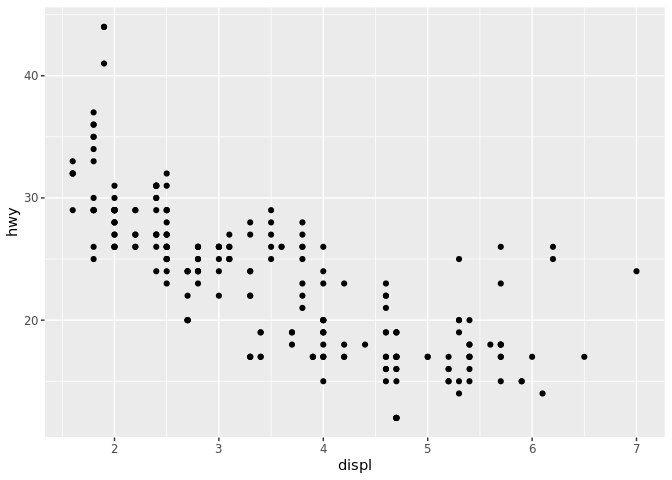

Your Turn 2
-----------

Replace this scatterplot with one that draws boxplots. Use the cheatsheet. Try your best guess.

``` r
ggplot(data = mpg) +
  geom_boxplot(mapping = aes(x = class, y = hwy))
```

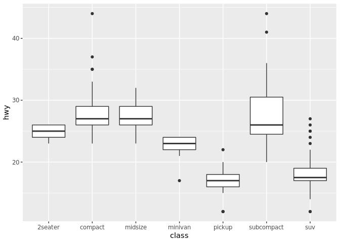

Your Turn 3
-----------

Make a histogram of the `hwy` variable from `mpg`. Hint: do not supply a y variable.

``` r
ggplot(data = mpg) +
  geom_histogram(mapping = aes(x = hwy))
```

    `stat_bin()` using `bins = 30`. Pick better value with `binwidth`.

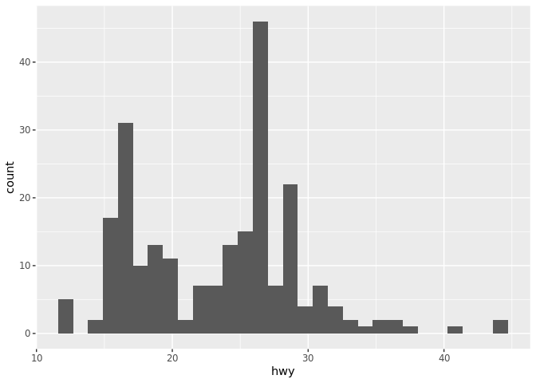

Your Turn 4
-----------

Use the help page for `geom_histogram` to make the bins 2 units wide.

``` r
ggplot(data = mpg) +
  geom_histogram(mapping = aes(x = hwy), binwidth = 1, color = "yellow", fill = "orange")
```

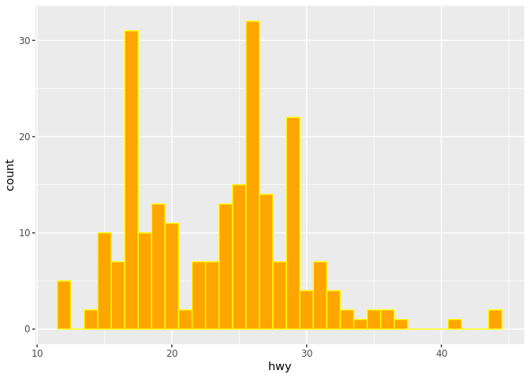

Your Turn 5
-----------

Add `color`, `size`, `alpha`, and `shape` aesthetics to your graph. Experiment.

``` r
ggplot(data = mpg) +
  geom_point(mapping = aes(x = displ, y = hwy, color = class))
```

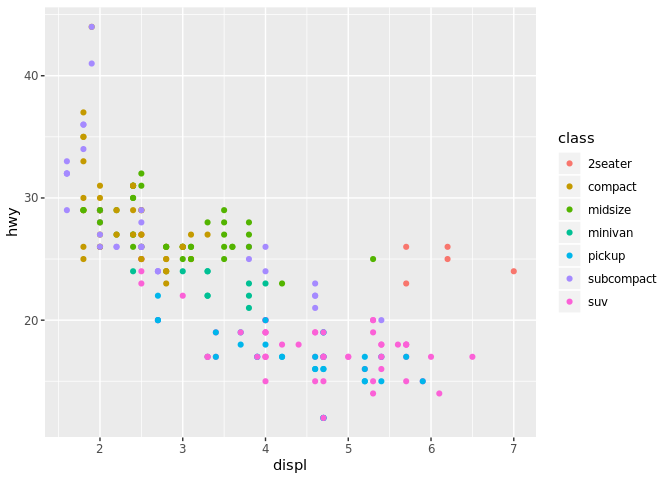

``` r
ggplot(data = mpg) +
  geom_point(mapping = aes(x = displ, y = hwy, size = class))
```

    Warning: Using size for a discrete variable is not advised.

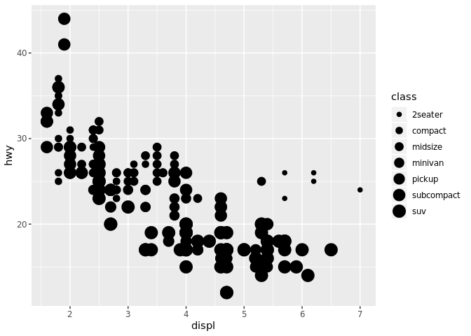

``` r
ggplot(data = mpg) +
  geom_point(mapping = aes(x = displ, y = hwy, shape = class))
```

    Warning: The shape palette can deal with a maximum of 6 discrete values
    because more than 6 becomes difficult to discriminate; you have 7.
    Consider specifying shapes manually if you must have them.

    Warning: Removed 62 rows containing missing values (geom_point).

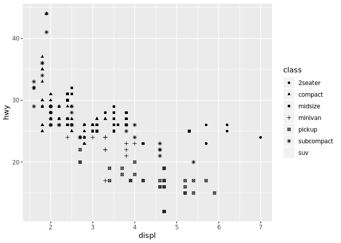

``` r
ggplot(data = mpg) +
  geom_point(mapping = aes(x = displ, y = hwy, alpha = class))
```

    Warning: Using alpha for a discrete variable is not advised.

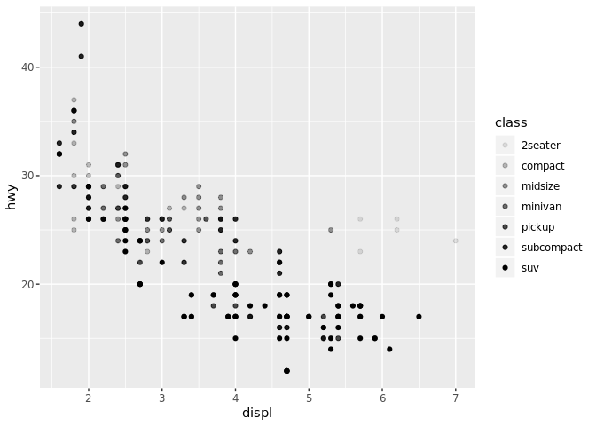

Help Me
-------

What do `facet_grid()` and `facet_wrap()` do? (run the code, interpret, convince your group)

``` r
# Makes a plot that the commands below will modify
q <- ggplot(mpg) + geom_point(aes(x = displ, y = hwy))

q + facet_grid(. ~ cyl)
```

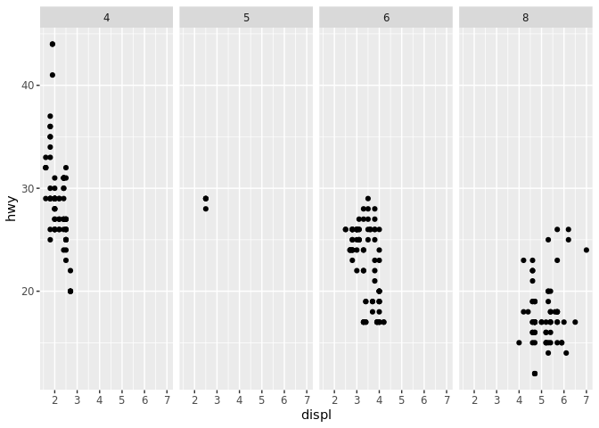

``` r
q + facet_grid(drv ~ .)
```

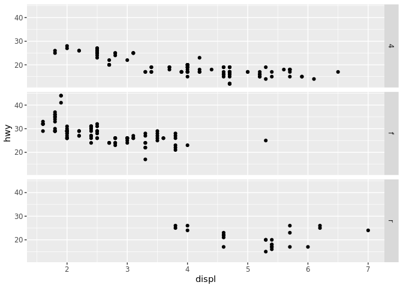

``` r
q + facet_grid(drv ~ cyl)
```

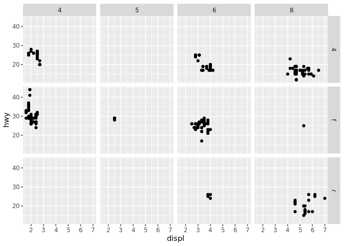

``` r
q + facet_wrap(~ class)
```

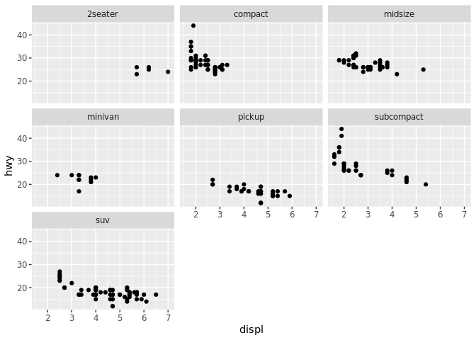

Your Turn 6
-----------

Make a bar chart `class` colored by `class`. Use the help page for `geom_bar` to choose a "color" aesthetic for class.

Quiz
----

What will this code do?

``` r
ggplot(mpg) + 
  geom_point(aes(displ, hwy)) +
  geom_smooth(aes(displ, hwy))
```

    `geom_smooth()` using method = 'loess' and formula 'y ~ x'

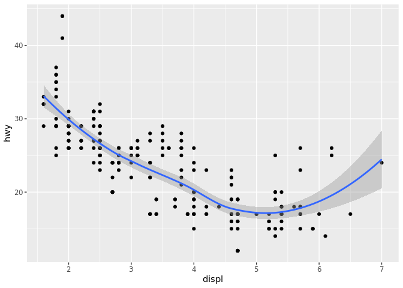

------------------------------------------------------------------------

Take aways
==========

You can use this code template to make thousands of graphs with **ggplot2**.

``` r
ggplot(data = <DATA>) +
  <GEOM_FUNCTION>(mapping = aes(<MAPPINGS>))
```
